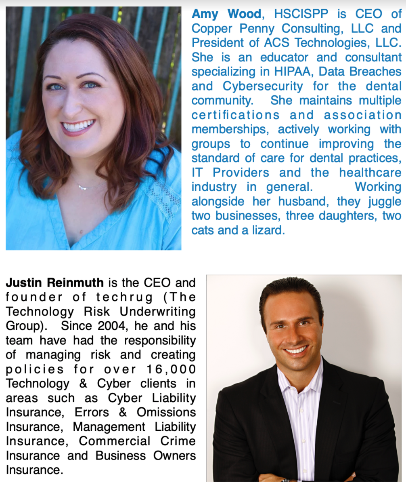

+++
title="ISC2 North Bay Chapter Virtual Bi-Monthly Event – Nov 2, 2021"
description="Cyber Risk Insurance - Challenges Choosing The Right Coverage for Your Business"
date="2021-11-02"
+++
Location: Virtual Zoom Meeting

Meeting Date: Tuesday, November 2, 2021
<!--more-->
## {}

<table>
<tr><td width="40%"></td><td style="vertical-align:top;line-height:1.75;">


If you are looking to learn more about cyber insurance and the role it plays in a risk management program, please join the (ISC)² North Bay Chapter for our virtual event entitled “Cyber Risk Insurance - Challenges Choosing The Right Coverage for Your Business". This event will be held Tuesday, Nov 2, 2021 from 6:00 PM PST to 7:30 PM PST, for 1.5 CPE hours.
A few years ago, no one had heard of cyber insurance. Today, everyone either wants it or has it; but most organizations are not sure if they have the right one. Having an insurance policy that is expressly dedicated to covering cyber-related incidents is critical; however, not all cyber insurance policies are created equal. In this event, our speakers, Amy Wood (CEO of Copper Penny Consulting) and Justin Reinmuth (CEO of Techrug) will go through the ‘ins and outs’ of cyber insurance and examine real-world examples to fully understand the scope of what a cyber insurance policy actually covers in the case of an incident, and what organization should think about when shopping for a policy.

</td></tr></table>

## Agenda 

6:00 PM - Start 

- ISC2 NBC President (Hanna Sicker) - Welcome and introduction of new chapter and board members

- ISC2 NBC Membership Chair (Chris Jones) - Explain member benefits

- ISC2 NBC Board Member - Introduction session goals and speaker 6:10 PM -Amy Wood and Justin Reinmuth - They will go through the ‘ins and outs’ of cyber insurance and examine real-world examples to fully understand the scope of what a cyber insurance policy actually covers in the case of an incident, and what an organization should think about when shopping for a policy.

6:30 PM – Q&A and open discussion moderated by Adam Sicker. 

7:00  PM – Closing Session – Next meeting is Chapter Election – Vote for board members and chapter president, or apply, if you are interested in applying to be an ISC2 NBC board member or for a president. Accepting application date by Nov 15, 2021

The Election date ends by Dec, 15, 2021 

